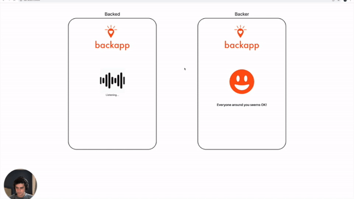

# BackApp

# An app that predicts voice distress and requests help from a community around you.

The prediction of my scream below...



## Setup

1. Install requirements
```
pip install -r requirements.txt
```

If an **error that portaudio was not found** when installing pyaudio comes up you have 2 solutions depending on your OS. 

For Ubuntu:
```
sudo apt install portaudio19-dev
```

For MacOS:

1 - Install Portaudio:
```
brew install portaudio
```

2 - Install PyAudio:
```
pip install PyAudio
```

2. Test the app by running:

```
python app.py
```

Which then you will open the browser with the url provided from Flask server and try the app.


## Acknowledgement

For the live ASR - oliverguhr/wav2vec2-live - Brilliant work!
